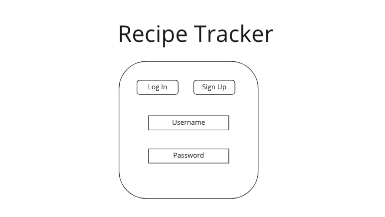
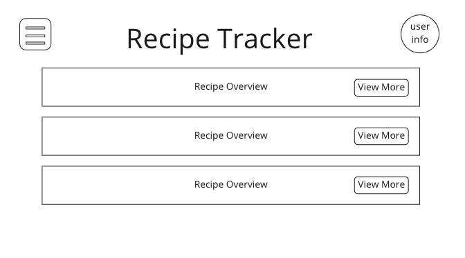
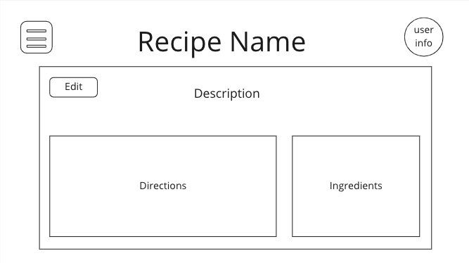
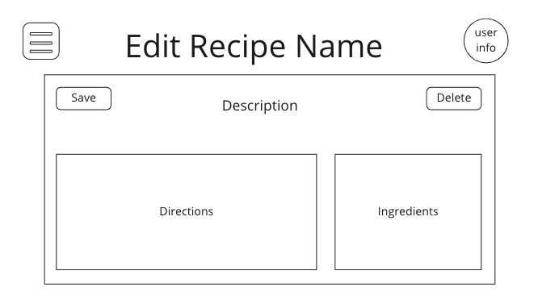
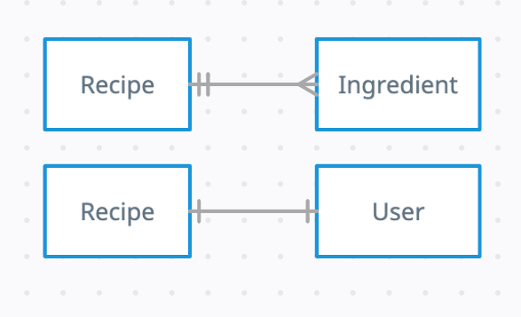

# Recipe Tracker

## Wireframes

Login Screen

Home Page / Index

Show Page

Edit Page

Create Page

## Entity Relationship Diagram

## MVP

- As a user, I want to be able to create an account
- As a user, I want to be able to log in
- As a user, I want to be able to log out
- As a user, I want to be able to delete my account
- As a user, I want to see all of my recipes once logged in
- As a user, I want to be able to create a recipe
- As a user, I want to be able to update a recipe
- As a user, I want to be able to delete a recipe
- As a user, I want to be able to view a single recipe

## Version 2

- As a user, I want to be able to choose different themes for the app
- As a user, I want to be able to rate recipes
- As a user, I want to organize my recipes in categories
- As a user, I want to be able to add a profile picture
- As a user, I want to be able to add pictures for recipes

## Version 3

- As a user, I want to be able to share recipes with friends
- As a user, I want to be able to choose a serving size and automatically adjust the recipe